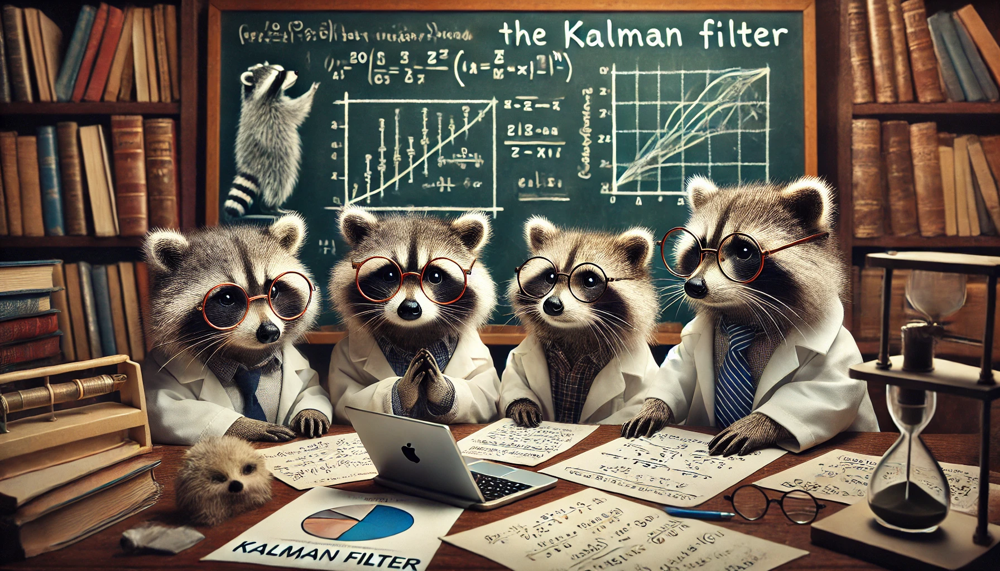

<div align="center">  
    <h1> Kalman Filter and Extensions </h1>
</div>

<div align="center">  
    
</div>

<p align="center">
    <a href="">
        
    </a>
    <a href="">
        
    </a>
</p>


<table>
    <tr>
        <td align="left"> <b> Title </b> </td>
        <td> Kalman Filter and Extensions </td>
    </tr>
    <tr>
        <td align="left"> <b> Authors </b> </td>
        <td> Matvei Kreinin, Maria Nikitina, Petr Babkin, Anastasia Voznyuk </td>
    </tr>
    <tr>
        <td align="left"> <b> Consultant </b> </td>
        <td> Oleg Bakhteev, PhD </td>
    </tr>
</table>

## 💡 Description

This project focuses on implementing Kalman Filters and their extensions in a simple and clear manner. Despite their importance, these state-space models remain underrepresented in the deep learning community. Our goal is to create a well-documented and efficient implementation that aligns with existing structured state-space models.

## 📌 Algorithms Implemented

We plan to implement the following distributions in our library:
- [x] **Kalman Filter**
- [ ] **Extended Kalman Filter (EKF)**
- [x] **Unscented Kalman Filter (UKF)**
- [ ] **Variational Kalman Filters**

## 🔗 Related Work

- [PyTorch implementation of Kalman Filters](https://github.com/raphaelreme/torch-kf?tab=readme-ov-file)
- [Extended Kalman Filter implementation in Pyro](https://pyro.ai/examples/ekf.html)
- Compatibility considerations with [S4 and other SSM state-of-the-art models](https://github.com/state-spaces/s4)

## 📚 Tech Stack

The project is implemented using:

- **Python**
- **PyTorch** for tensor computation and differentiation
- **NumPy** for numerical computations
- **SciPy** for advanced mathematical functions
- **Jupyter Notebooks** for experimentation and visualization

You can install the required packages using pip:

## Installation

1. Clone the repository:
    ```bash
    git clone https://github.com/intsystems/Kalman-filter-and-his-friends /tmp/Kalman-filter-and-his-friends
    ```
2. Install the dependencies:
    ```bash
    python3 -m pip install /tmp/Kalman-filter-and-his-friends/src/
    ```

Uninstall:

```bash
python3 -m pip uninstall kalman
```

## 👨‍💻 Usage

Basic usage examples for different filters will be provided. Below is an example of using a Kalman Filter in PyTorch:

```python
import torch
from kalman_filter import KalmanFilter

kf = KalmanFilter(dim_x=4, dim_z=2)
kf.predict()
kf.update(torch.tensor([1.0, 2.0]))
print(kf.x)  # Updated state estimate
```

More detailed examples and tutorials will be available in the documentation.

## 📬 Links

- [Library Documentation](https://intsystems.github.io/Kalman-filter-and-his-friends/)
- [Project Documentation](./docs/plan.md)
- [Project Plan](...)
- [Matvei Kreinin](https://github.com/kreininmv), [Maria Nikitina](https://github.com/NikitinaMaria), [Petr Babkin](https://github.com/petr-parker), [Anastasia Voznyuk](https://github.com/natriistorm)
---

Feel free to modify and expand this README as needed to fit your project's specific goals and implementation details!

