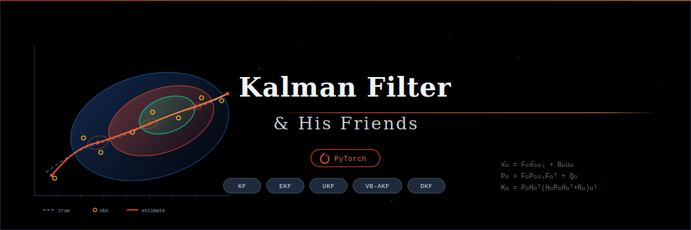

<div align="center">
    <h1> Kalman Filter and Extensions </h1>
</div>

<div align="center">
    
</div>

<p align="center">
    <a href="https://pytorch.org/">
        
    </a>
    <a href="https://www.python.org/">
        
    </a>
    <a href="https://github.com/intsystems/Kalman-filter-and-his-friends/actions/workflows/docs.yml">
        
    </a>
    <a href="https://opensource.org/licenses/MIT">
        
    </a>
</p>

<table>
    <tr>
        <td align="left"> <b> Authors </b> </td>
        <td> Matvei Kreinin, Maria Nikitina, Petr Babkin, Anastasia Voznyuk </td>
    </tr>
    <tr>
        <td align="left"> <b> Consultant </b> </td>
        <td> Oleg Bakhteev, PhD </td>
    </tr>
</table>

## Description

A PyTorch library of Kalman filters and extensions with full autograd support. All filter parameters (transition matrices, noise covariances, initial states) are registered as `nn.Parameter` and can be trained via standard PyTorch optimizers. Covariance matrices are parameterized via Cholesky decomposition to guarantee positive-definiteness during optimization.

## Algorithms

| Filter | Model | Jacobians | Adaptive R | Trainable |
|--------|-------|-----------|------------|-----------|
| **KalmanFilter** | Linear | -- | No | F, H, Q, R |
| **ExtendedKalmanFilter** | Nonlinear | Yes / autograd | No | Q, R, init |
| **UnscentedKalmanFilter** | Nonlinear | No | No | Q, R, init |
| **VBKalmanFilter** | Linear | -- | Yes | F, H, Q |
| **DeepKalmanFilter** | Neural network | -- | -- | All weights |

## Installation

```bash
git clone https://github.com/intsystems/Kalman-filter-and-his-friends
cd Kalman-filter-and-his-friends
pip install src/
```

## Quick Start

```python
import torch
from kalman.filters import KalmanFilter
from kalman.gaussian import GaussianState

F = torch.eye(4)                          # transition matrix
H = torch.eye(2, 4)                       # measurement matrix
Q = 0.01 * torch.eye(4)                   # process noise
R = 0.1 * torch.eye(2)                    # measurement noise

kf = KalmanFilter(F, H, Q, R)

state = GaussianState(
    mean=torch.zeros(4),
    covariance=torch.eye(4),
)

for z in torch.randn(20, 2):              # 20 observations
    state = kf.predict(state)
    state = kf.update(state, z)

print(state.mean)                         # filtered state estimate
```

### Training filter parameters

```python
optimizer = torch.optim.Adam(kf.parameters(), lr=1e-3)

for epoch in range(100):
    optimizer.zero_grad()
    state = GaussianState(torch.zeros(4), torch.eye(4))
    loss = 0.0
    for t, z in enumerate(observations):
        state = kf.predict(state)
        state = kf.update(state, z)
        loss = loss + ((state.mean - targets[t]) ** 2).sum()
    loss.backward()
    optimizer.step()
```

## Examples

| Notebook | Description |
|----------|-------------|
| [`tutorial.ipynb`](notebooks/tutorial.ipynb) | All filters on circular motion tracking |
| [`example_unscented.ipynb`](notebooks/example_unscented.ipynb) | EKF vs UKF on radar tracking (polar observations) |
| [`example_variational.ipynb`](notebooks/example_variational.ipynb) | VBF with time-varying noise, DKF on synthetic signals |
| [`example_satellite.ipynb`](notebooks/example_satellite.ipynb) | Satellite orbit tracking with Keplerian dynamics |
| [`example_mnist.ipynb`](notebooks/example_mnist.ipynb) | DKF trained on MNIST digit sequences |

## Testing

```bash
pip install pytest filterpy
pytest tests/ -v
```

85 tests covering correctness (vs filterpy reference), gradient flow, training convergence, and numerical stability.

## Documentation

- [Library Documentation](https://intsystems.github.io/Kalman-filter-and-his-friends/)
- [Blogpost](https://www.overleaf.com/read/qyvhbszcygjn#4ff3b8)

## Related Work

- [torch-kf](https://github.com/raphaelreme/torch-kf) -- PyTorch Kalman Filter
- [Pyro EKF](https://pyro.ai/examples/ekf.html) -- Extended Kalman Filter in Pyro
- [S4](https://github.com/state-spaces/s4) -- Structured State Space Models

## Authors

- [Matvei Kreinin](https://github.com/kreininmv)
- [Maria Nikitina](https://github.com/NikitinaMaria)
- [Petr Babkin](https://github.com/petr-parker)
- [Anastasia Voznyuk](https://github.com/natriistorm)

## License

MIT
